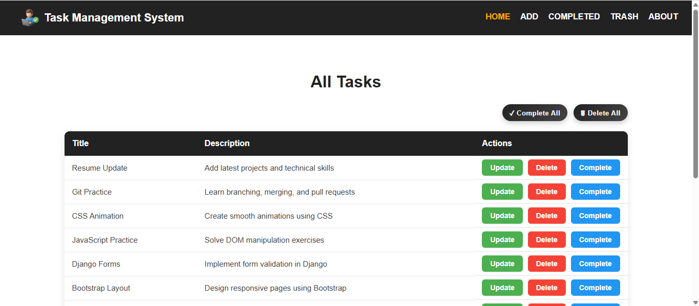
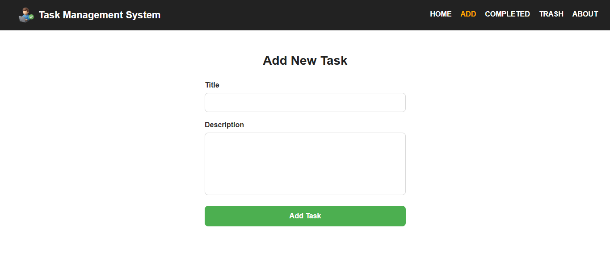
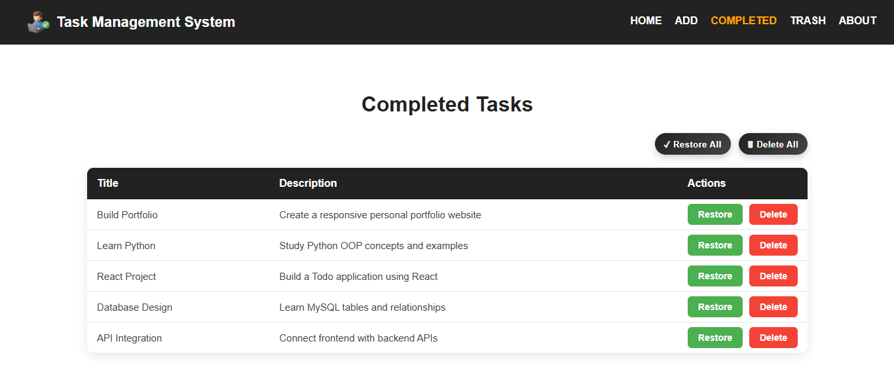
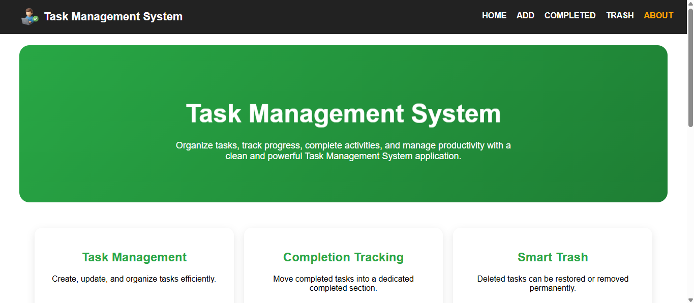

# Task Management System

A modern Task Management System built using Django that helps users organize daily tasks efficiently. The application provides complete task lifecycle management including task creation, updates, completion tracking, trash management, restoration, and permanent deletion.

---

## Project Overview

The Task Management System is a Django-based web application designed to simplify task organization and productivity management.

Users can:

- Create tasks
- Update task information
- Mark tasks as completed
- Move tasks to trash
- Restore deleted tasks
- Permanently delete tasks
- Manage all tasks through a clean and responsive interface

This project demonstrates practical implementation of Django Models, Views, Templates, URL Routing, Database Operations, and CRUD functionality.

---

## Application Screenshots

### Home Page



### Add Task Page



### Completed Tasks Page



### Trash Page


### About Page



---

## Features

### Task Management

- Add New Tasks
- View All Tasks
- Update Existing Tasks
- Delete Tasks
- Complete Tasks

### Completed Tasks

- View Completed Tasks
- Restore Completed Tasks
- Restore All Completed Tasks
- Move Completed Tasks to Trash
- Delete All Completed Tasks

### Trash Management

- View Deleted Tasks
- Restore Individual Tasks
- Restore All Tasks
- Permanently Delete Individual Tasks
- Permanently Delete All Tasks

### User Interface

- Responsive Design
- Fixed Navigation Bar
- Professional Table Layout
- Modern Forms
- Mobile Friendly Design
- About Page
- Interactive Buttons and Hover Effects

---

## Technologies Used

### Frontend

- HTML5
- CSS3
- Django Templates

### Backend

- Python
- Django Framework

### Database

- SQLite3

### Development Tools

- Visual Studio Code
- Git
- GitHub

---

## Project Architecture

Client Request

↓

URL Routing

↓

Views

↓

Models

↓

SQLite Database

↓

Templates

↓

CSS Styling

↓

Response

---

## Database Models

### TaskModel

Stores all active tasks.

```python
class TaskModel(models.Model):
    title = models.CharField(max_length=100)
    description = models.TextField()
```

### CompleteModel

Stores completed tasks.

```python
class CompleteModel(models.Model):
    title = models.CharField(max_length=100)
    description = models.TextField()
```

### TrashModel

Stores deleted tasks.

```python
class TrashModel(models.Model):
    title = models.CharField(max_length=100)
    description = models.TextField()
```

---

## Application Workflow

### Active Task Flow

Task Created

↓

Home Page

↓

Update / Complete / Delete

---

### Completed Task Flow

Complete Task

↓

Completed Section

↓

Restore

or

↓

Move to Trash

---

### Trash Task Flow

Delete Task

↓

Trash Section

↓

Restore

or

↓

Permanent Delete

---

## Pages Included

### Home Page

Displays all active tasks.

Features:

- Update Task
- Delete Task
- Complete Task
- Complete All Tasks
- Delete All Tasks

### Add Task Page

Allows users to create new tasks.

Features:

- Title Input
- Description Input
- Form Validation
- Save Task

### Update Task Page

Allows users to modify existing tasks.

Features:

- Edit Title
- Edit Description
- Save Changes

### Completed Tasks Page

Displays completed tasks.

Features:

- Restore Task
- Delete Task
- Restore All
- Delete All

### Trash Page

Displays deleted tasks.

Features:

- Restore Task
- Permanently Delete Task
- Restore All
- Permanently Delete All

### About Page

Provides project details and technology information.

---

## Project Structure

```text
django-todo-crud/
│
├── base/
│   ├── migrations/
│   ├── models.py
│   ├── views.py
│   ├── urls.py
│   └── admin.py
│
├── templates/
│   ├── main.html
│   ├── nav.html
│   ├── home.html
│   ├── add.html
│   ├── update.html
│   ├── completed.html
│   ├── trash.html
│   └── about.html
│
├── static/
│   └── css/
│       └── style.css
│
├── myproject/
│   ├── settings.py
│   ├── urls.py
│   ├── asgi.py
│   └── wsgi.py
│
├── manage.py
└── README.md
```

---

## Installation

### Clone Repository

```bash
git clone https://github.com/nikunjhadiya/django-todo-crud.git
```

### Move Into Project

```bash
cd django-todo-crud
```

### Create Virtual Environment

```bash
python -m venv myenv
```

### Activate Environment

```bash
myenv\Scripts\activate
```

### Install Django

```bash
pip install django
```

### Apply Migrations

```bash
python manage.py makemigrations
python manage.py migrate
```

### Run Server

```bash
python manage.py runserver
```

Open:

```text
http://127.0.0.1:8000/
```

---

## Skills Demonstrated

- Python Programming
- Django Framework
- CRUD Operations
- Database Management
- SQLite
- MVT Architecture
- Template Inheritance
- Responsive Web Design
- Git Version Control
- GitHub Collaboration

---

## Future Enhancements

- User Authentication
- Search Tasks
- Task Categories
- Task Priorities
- Due Dates
- REST API Integration
- Dashboard Analytics
- Dark Mode
- Email Notifications

---

## Author

Nikunj Hadiya

Python Developer | Django Developer

Portfolio:
https://nikunjhadiya.netlify.app/

LinkedIn:
https://www.linkedin.com/in/nikunjhadiya/

GitHub:
https://github.com/nikunjhadiya

---

⭐ If you found this project useful, consider giving it a star on GitHub.
